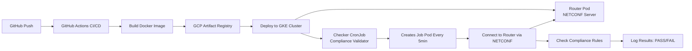

<p align="center">
  
</p>

<p align="center">
  
  
  
</p>

# netconf-k8s

**A cloud-native microservice for continuous network compliance checking using NETCONF and Kubernetes.**

## 🎯 Project Goal

This project demonstrates a complete DevOps workflow for network automation by implementing a **Network Compliance Checker** that periodically validates network device configurations against security policies. The system connects to network equipment via NETCONF protocol to ensure compliance with best practices such as disabling Telnet, enabling NTP synchronization, and enforcing proper hostname conventions. This showcases the integration of network automation, container orchestration, and modern CI/CD practices.

## 🏗️ Architecture & Flow



**Component Roles:**

- **GitHub Actions**: Automates the build, test, and deployment pipeline
- **GCP Artifact Registry**: Stores Docker images securely in the cloud
- **GKE Cluster**: Orchestrates containerized workloads in a Kubernetes environment
- **Router Pod**: Runs a NETCONF-enabled network device simulator (sysrepo/netopeer2)
- **Checker CronJob**: Schedules periodic compliance checks every 5 minutes
- **Compliance Logic**: Validates configuration against policies (NTP enabled, Telnet disabled, correct hostname)

For a deep dive into the architecture, including screenshots and detailed flow diagrams, see the [Architecture Documentation](docs/architecture.md).

## ☁️ Google Cloud Platform (GCP) Setup

To reproduce this project, you'll need to configure GCP:

1. **Create a GCP Project**
   ```bash
   gcloud projects create YOUR_PROJECT_ID
   gcloud config set project YOUR_PROJECT_ID
   ```

2. **Enable Required APIs**
   ```bash
   gcloud services enable container.googleapis.com
   gcloud services enable artifactregistry.googleapis.com
   gcloud services enable compute.googleapis.com
   ```

3. **Create a GKE Cluster**
   ```bash
   gcloud container clusters create netconf-cluster \
     --zone=us-central1-a \
     --num-nodes=2 \
     --machine-type=e2-medium
   ```

4. **Create an Artifact Registry Repository**
   ```bash
   gcloud artifacts repositories create netconf-repo \
     --repository-format=docker \
     --location=us-central1 \
     --description="Docker repository for netconf-k8s"
   ```

5. **Create a Service Account for GitHub Actions**
   ```bash
   gcloud iam service-accounts create github-actions-sa \
     --display-name="GitHub Actions Service Account"

   gcloud projects add-iam-policy-binding YOUR_PROJECT_ID \
     --member="serviceAccount:github-actions-sa@YOUR_PROJECT_ID.iam.gserviceaccount.com" \
     --role="roles/container.developer"

   gcloud projects add-iam-policy-binding YOUR_PROJECT_ID \
     --member="serviceAccount:github-actions-sa@YOUR_PROJECT_ID.iam.gserviceaccount.com" \
     --role="roles/artifactregistry.writer"

   gcloud iam service-accounts keys create key.json \
     --iam-account=github-actions-sa@YOUR_PROJECT_ID.iam.gserviceaccount.com
   ```

6. **Configure GitHub Secrets**
   - Go to your GitHub repository settings
   - Navigate to `Secrets and variables` > `Actions`
   - Add the following secrets:
     - `GCP_PROJECT_ID`: Your GCP project ID
     - `GCP_SA_KEY`: Contents of the `key.json` file (base64 encoded)

## 🚀 How It Works (The CI/CD Pipeline)

1. **Code Push**: When you push code to the `main` branch, GitHub Actions triggers automatically

2. **Build Phase**:
   - The workflow checks out the code
   - Builds the Docker image using the multi-stage Dockerfile
   - Tags the image with the commit SHA

3. **Push Phase**:
   - Authenticates to GCP using the service account key
   - Pushes the Docker image to GCP Artifact Registry

4. **Deploy Phase**:
   - Connects to the GKE cluster
   - Applies Kubernetes manifests (`k8s/*.yaml`)
   - Updates the CronJob with the new image

5. **Runtime**:
   - The Router Deployment runs continuously, simulating a NETCONF-enabled network device
   - The Checker CronJob spawns a Pod every 5 minutes
   - Each Pod connects to the router, retrieves the configuration, and validates compliance
   - Results are logged and visible in GKE console

## 📁 Project Structure

```
.
├── .github/
│   └── workflows/
│       └── ci-cd.yml          # GitHub Actions CI/CD pipeline
├── assets/
│   └── logo.png               # Project logo
├── cmd/
│   └── main.go                # Main Go application (NETCONF client)
├── docs/
│   └── architecture.md        # Detailed architecture documentation
├── k8s/
│   ├── checker-cronjob.yaml   # Kubernetes CronJob for compliance checks
│   └── router-deployment.yaml # Kubernetes Deployment for NETCONF router
├── Dockerfile                 # Multi-stage Docker build
├── go.mod                     # Go module dependencies
├── go.sum                     # Go module checksums
└── README.md                  # This file
```

## 🛠️ Local Development

### Prerequisites

- Go 1.21+
- Docker
- kubectl
- minikube (optional, for local Kubernetes testing)

### Running Locally with Docker Compose

Create a `docker-compose.yml` file:

```yaml
version: '3.8'
services:
  router:
    image: sysrepo/sysrepo-netopeer2:latest
    ports:
      - "830:830"

  checker:
    build: .
    command: ["--router-address=router:830"]
    depends_on:
      - router
```

Run the stack:

```bash
docker-compose up
```

### Running Locally with Minikube

```bash
# Start minikube
minikube start

# Build the image
docker build -t netconf-k8s-inspector:local .

# Load image into minikube
minikube image load netconf-k8s-inspector:local

# Apply Kubernetes manifests
kubectl apply -f k8s/

# View logs
kubectl logs -l app=netconf-router
kubectl logs -l app=netconf-checker
```

### Testing the Go Application Directly

```bash
# Install dependencies
go mod download

# Run the compliance checker
go run cmd/main.go --router-address=localhost:830
```

## 🧪 Testing

The compliance checker validates the following rules:

- ✅ **NTP Configuration**: Ensures NTP is enabled for time synchronization
- ❌ **Telnet Disabled**: Verifies that insecure Telnet access is not enabled
- ✅ **Hostname Compliance**: Checks that the hostname follows naming conventions

Example output:

```
[INFO] Connecting to NETCONF router at netconf-router-service:830
[INFO] Retrieving running configuration...
[PASS] ✓ NTP is enabled
[PASS] ✓ Telnet is disabled
[PASS] ✓ Hostname follows naming convention
[PASS] Compliance check successful!
```

## 📄 License

This project is licensed under the MIT License. See the [LICENSE](LICENSE) file for details.

---

<p align="center">
  Made with ☕ and Kubernetes
</p>
