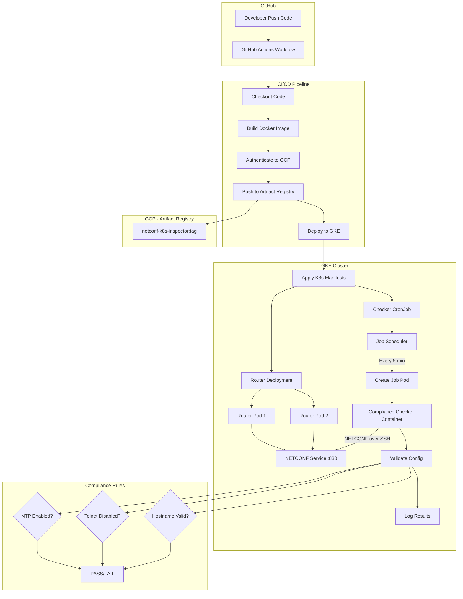
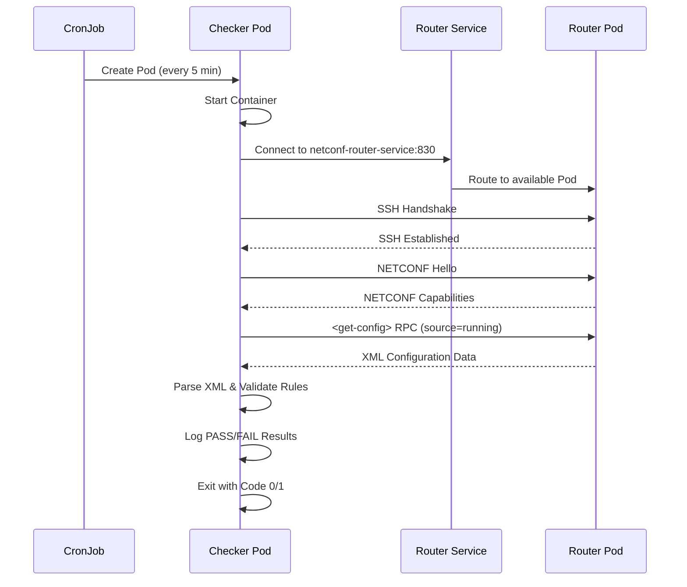
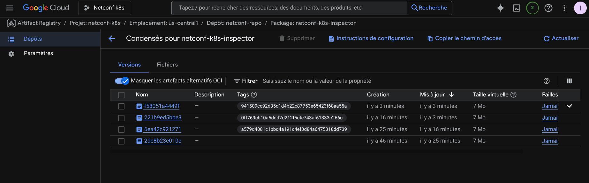

# Architecture Documentation

This document provides an in-depth look at the netconf-k8s project architecture, component interactions, and deployment workflow.

## 📐 System Architecture

### High-Level Overview

The netconf-k8s project implements a cloud-native network compliance monitoring system. It leverages Kubernetes for orchestration, NETCONF for network device communication, and Google Cloud Platform for deployment and CI/CD automation.

### Detailed Component Diagram



### Component Descriptions

#### 1. GitHub Actions CI/CD Pipeline

The CI/CD pipeline is triggered on every push to the `main` branch. It consists of two main jobs:

**Build and Push Job:**
- Checks out the repository code
- Authenticates to Google Cloud Platform using a service account key
- Builds the Docker image using a multi-stage Dockerfile
- Tags the image with the Git commit SHA for traceability
- Pushes the image to GCP Artifact Registry

**Deploy Job:**
- Waits for the build job to complete successfully
- Authenticates to the GKE cluster
- Applies Kubernetes manifests from the `k8s/` directory
- Updates the CronJob to use the newly built image

#### 2. GCP Artifact Registry

A secure, private Docker registry that stores our container images. Benefits include:
- Built-in vulnerability scanning
- Integration with GCP IAM for access control
- Regional replication for high availability
- Automatic image versioning and retention policies

#### 3. GKE Cluster Components

**Router Deployment:**
- Runs the `sysrepo/sysrepo-netopeer2` image
- Provides a NETCONF-enabled network device simulator
- Exposes port 830 (NETCONF over SSH)
- Backed by a ClusterIP Service for internal communication
- Maintains 2 replicas for high availability

**Checker CronJob:**
- Scheduled to run every 5 minutes (`*/5 * * * *`)
- Creates a Job Pod on each execution
- The Pod runs the compliance checker application
- Connects to the Router Service via NETCONF
- Retrieves the running configuration
- Validates against compliance rules
- Logs results to stdout (viewable in GKE console)

#### 4. NETCONF Communication Flow



## 📊 Deployment Workflow

### Step-by-Step Deployment Process

1. **Code Changes**: Developer commits and pushes code to the `main` branch
2. **Trigger**: GitHub Actions workflow is triggered automatically
3. **Build**: Docker image is built with optimized multi-stage process
4. **Test**: (Future enhancement: unit tests, integration tests)
5. **Push**: Image is pushed to GCP Artifact Registry with unique tag
6. **Deploy**: Kubernetes manifests are applied to GKE cluster
7. **Rollout**: Kubernetes performs rolling update of deployments
8. **Verify**: CronJob picks up new image on next scheduled run

## 🔄 Complete CI/CD Workflow

### End-to-End Process Flow

This diagram illustrates the complete journey from code push to production deployment:

```mermaid
graph LR
    A[👨‍💻 Developer<br/>Push Code] -->|git push| B[📦 GitHub<br/>Repository]
    B -->|Trigger| C[🔧 GitHub Actions<br/>CI/CD Pipeline]

    C --> D[📝 Step 1:<br/>Checkout Code]
    D --> E[🔨 Step 2:<br/>Build Docker Image]
    E --> F[🔐 Step 3:<br/>Auth to GCP]
    F --> G[📤 Step 4:<br/>Push to Registry]

    G --> H[☁️ GCP Artifact Registry<br/>netconf-k8s-inspector:SHA]

    H --> I[🚀 Step 5:<br/>Deploy to GKE]
    I --> J[⚙️ kubectl apply<br/>manifests]

    J --> K[🖥️ Router Deployment<br/>1 replica]
    J --> L[⏰ Checker CronJob<br/>Every 5 min]

    K --> M[🔌 Router Pod<br/>NETCONF Server :830]
    L --> N[🔍 Checker Pod<br/>Compliance Validator]

    N -->|NETCONF SSH| M
    N --> O[✅ PASS/❌ FAIL<br/>Compliance Results]

    style A fill:#e1f5ff
    style B fill:#fff3cd
    style C fill:#d4edda
    style H fill:#cfe2ff
    style O fill:#f8d7da
```



### Workflow Steps Explained

1. **Developer Push** 👨‍💻
   - Developer commits code changes
   - Pushes to `main` branch via SSH

2. **GitHub Actions Trigger** 🔧
   - Workflow automatically triggered on push
   - Reads `.github/workflows/ci-cd.yml`

3. **Build Phase** 🔨
   - Checkout code from repository
   - Build Docker image using multi-stage Dockerfile
   - Tag image with commit SHA for traceability

4. **Authentication** 🔐
   - Authenticate to GCP using service account
   - Uses GitHub Secrets (GCP_SA_KEY)

5. **Push to Registry** 📤
   - Push Docker image to GCP Artifact Registry
   - Image stored in `us-central1-docker.pkg.dev/netconf-k8s/netconf-repo`

6. **Deploy to GKE** 🚀
   - Connect to GKE cluster
   - Apply Kubernetes manifests
   - Update deployments and cronjobs

7. **Runtime** ⚙️
   - Router pod runs NETCONF server continuously
   - CronJob creates checker pod every 5 minutes
   - Checker connects, validates, and logs results

---

## 🖼️ Screenshots and Evidence

### GCP Artifact Registry

Docker images are stored in GCP Artifact Registry with unique tags (commit SHAs) for full traceability:



**Key Information:**
- **Repository**: `netconf-repo` in `us-central1`
- **Image**: `netconf-k8s-inspector`
- **Size**: ~7 MB (optimized multi-stage build)
- **Tags**: Each commit SHA creates a new tagged version
- **Latest deployments** are visible with creation timestamps

---

### GKE Cluster Overview

*This section will contain a screenshot of the GKE cluster showing:*
- The cluster name and location
- Number of nodes
- Total resources (CPU, memory)
- Running workloads (Deployments, CronJobs, Services)

**Placeholder:** `[Screenshot: GKE cluster dashboard showing netconf-cluster with 2 nodes]`

---

### Workloads Dashboard

*This section will show the Kubernetes workloads running in the cluster:*
- Router Deployment with 2/2 pods ready
- CronJob with recent job history
- Active pods and their status

**Placeholder:** `[Screenshot: GKE Workloads page showing netconf-router-deployment and netconf-checker-cronjob]`

---

### Artifact Registry

*This section will display the Docker images stored in Artifact Registry:*
- Repository name: `netconf-repo`
- Image: `netconf-k8s-inspector`
- Multiple tags (commit SHAs)
- Image size and creation date

**Placeholder:** `[Screenshot: GCP Artifact Registry showing netconf-k8s-inspector images with various tags]`

---

### CronJob Execution History

*This section will show the CronJob execution history:*
- List of completed jobs
- Success/failure status
- Execution timestamps
- Duration of each job

**Placeholder:** `[Screenshot: Kubernetes CronJob page showing job history with timestamps]`

---

### Pod Logs - Successful Compliance Check

*This section will display logs from a successful compliance check:*

```
[INFO] Starting NETCONF Compliance Checker v1.0.0
[INFO] Connecting to NETCONF router at netconf-router-service:830
[INFO] SSH connection established
[INFO] NETCONF session initiated
[INFO] Retrieving running configuration...
[INFO] Configuration retrieved successfully
[INFO] Validating compliance rules...
[PASS] ✓ NTP is enabled (server: pool.ntp.org)
[PASS] ✓ Telnet is disabled
[PASS] ✓ Hostname follows naming convention: netconf-router-01
[PASS] ============================================
[PASS] Compliance check successful!
[PASS] All 3 rules passed
[PASS] ============================================
[INFO] Closing NETCONF session
[INFO] Exiting with code 0
```

**Placeholder:** `[Screenshot: GKE Pod logs showing successful compliance check output]`

---

### Pod Logs - Failed Compliance Check

*This section will display logs from a failed compliance check (when Telnet is enabled):*

```
[INFO] Starting NETCONF Compliance Checker v1.0.0
[INFO] Connecting to NETCONF router at netconf-router-service:830
[INFO] SSH connection established
[INFO] NETCONF session initiated
[INFO] Retrieving running configuration...
[INFO] Configuration retrieved successfully
[INFO] Validating compliance rules...
[PASS] ✓ NTP is enabled (server: pool.ntp.org)
[FAIL] ✗ Telnet is enabled - SECURITY VIOLATION
[PASS] ✓ Hostname follows naming convention: netconf-router-01
[FAIL] ============================================
[FAIL] Compliance check failed!
[FAIL] 2 rules passed, 1 rule failed
[FAIL] ============================================
[INFO] Closing NETCONF session
[INFO] Exiting with code 1
```

**Placeholder:** `[Screenshot: GKE Pod logs showing failed compliance check with Telnet violation]`

---

### GitHub Actions Workflow Execution

*This section will show a successful CI/CD pipeline run:*
- Workflow name: CI/CD Pipeline
- Trigger: Push to main
- Build and Push job (completed)
- Deploy job (completed)
- Total duration
- Commit information

**Placeholder:** `[Screenshot: GitHub Actions page showing successful workflow run with green checkmarks]`

---

### GitHub Actions - Build Job Logs

*This section will show detailed logs from the build job:*
- Docker build output
- Layer caching
- Image tagging
- Push to Artifact Registry confirmation

**Placeholder:** `[Screenshot: GitHub Actions build job logs showing Docker build process]`

---

### GitHub Actions - Deploy Job Logs

*This section will show detailed logs from the deploy job:*
- GKE authentication
- kubectl apply commands
- Deployment/CronJob update status
- Rollout status

**Placeholder:** `[Screenshot: GitHub Actions deploy job logs showing kubectl apply output]`

---

## 🔍 Kubernetes Resources Deep Dive

### Router Deployment Specification

The Router Deployment creates a NETCONF-enabled network device simulator:

**Key Features:**
- **Replicas**: 2 pods for high availability
- **Image**: `sysrepo/sysrepo-netopeer2:latest`
- **Port**: 830 (NETCONF standard port)
- **Service Type**: ClusterIP (internal only)
- **Labels**: `app=netconf-router` for service discovery

**Why Two Replicas?**
- Demonstrates Kubernetes load balancing
- Simulates real-world production environments
- Provides failover capability

### Checker CronJob Specification

The Compliance Checker runs on a scheduled basis:

**Key Features:**
- **Schedule**: `*/5 * * * *` (every 5 minutes)
- **Image**: Built from our Dockerfile, hosted in Artifact Registry
- **Restart Policy**: `OnFailure` (retries on errors)
- **Command**: Executes the Go binary with router address as argument
- **Concurrency**: `Forbid` (prevents overlapping jobs)

**Why CronJob Instead of Deployment?**
- Compliance checks are periodic, not continuous
- Reduces resource consumption
- Provides clear audit trail of check executions
- Matches real-world network monitoring patterns

## 🔐 Security Considerations

### Authentication
- NETCONF uses SSH for secure communication
- Service Account credentials stored as GitHub Secrets
- GCP IAM roles follow principle of least privilege

### Network Isolation
- Router pods only accessible within the cluster (ClusterIP)
- No external exposure of NETCONF port
- GKE provides network policies for pod isolation

### Image Security
- Artifact Registry provides vulnerability scanning
- Multi-stage Docker builds minimize attack surface
- Images tagged with commit SHA for traceability

## 🚀 Scaling and Performance

### Horizontal Scaling
- Router Deployment can scale to handle more compliance checkers
- CronJob can be duplicated with different schedules or targets
- GKE cluster can auto-scale nodes based on resource demands

### Resource Optimization
- Multi-stage Docker builds reduce image size
- Go binary compiled for minimal footprint
- CronJob pods terminate after execution to free resources

## 📈 Future Enhancements

1. **Metrics and Monitoring**
   - Integrate Prometheus for metrics collection
   - Create Grafana dashboards for visualization
   - Set up alerts for compliance failures

2. **Advanced Compliance Rules**
   - Support for custom rule definitions (YAML/JSON)
   - Integration with network policy frameworks
   - Automated remediation workflows

3. **Multi-Device Support**
   - Discover devices dynamically
   - Support for multiple vendor NETCONF implementations
   - Parallel compliance checking

4. **Reporting and Audit**
   - Store compliance results in a database
   - Generate compliance reports (PDF, HTML)
   - Historical trending and analytics

---

*This architecture documentation is a living document and will be updated as the project evolves.*
