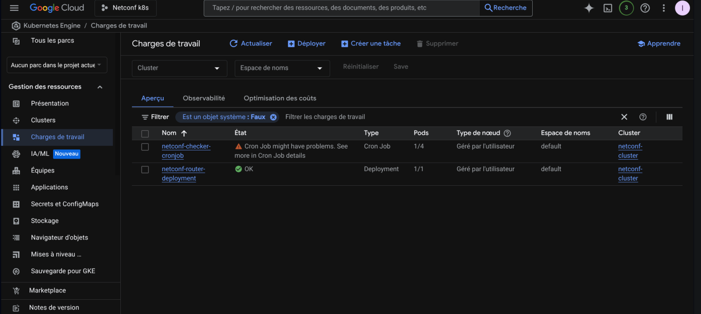

# Architecture Documentation

This document provides an in-depth look at the netconf-k8s project architecture, component interactions, and deployment workflow.

## 📐 System Architecture

### High-Level Overview

The netconf-k8s project implements a cloud-native network compliance monitoring system. It leverages Kubernetes for orchestration, NETCONF for network device communication, and Google Cloud Platform for deployment and CI/CD automation.

### Detailed Component Diagram


### Component Descriptions

#### 1. GitHub Actions CI/CD Pipeline

The CI/CD pipeline is triggered on every push to the `main` branch. It consists of two main jobs:

**Build and Push Job:**
- Checks out the repository code
- Authenticates to Google Cloud Platform using a service account key
- Builds the Docker image using a multi-stage Dockerfile
- Tags the image with the Git commit SHA for traceability
- Pushes the image to GCP Artifact Registry

**Deploy Job:**
- Waits for the build job to complete successfully
- Authenticates to the GKE cluster
- Applies Kubernetes manifests from the `k8s/` directory
- Updates the CronJob to use the newly built image

#### 2. GCP Artifact Registry

A secure, private Docker registry that stores our container images. Benefits include:
- Built-in vulnerability scanning
- Integration with GCP IAM for access control
- Regional replication for high availability
- Automatic image versioning and retention policies

#### 3. GKE Cluster Components

**Router Deployment:**
- Runs the `sysrepo/sysrepo-netopeer2` image
- Provides a NETCONF-enabled network device simulator
- Exposes port 830 (NETCONF over SSH)
- Backed by a ClusterIP Service for internal communication
- Maintains 2 replicas for high availability

**Checker CronJob:**
- Scheduled to run every 5 minutes (`*/5 * * * *`)
- Creates a Job Pod on each execution
- The Pod runs the compliance checker application
- Connects to the Router Service via NETCONF
- Retrieves the running configuration
- Validates against compliance rules
- Logs results to stdout (viewable in GKE console)

#### 4. NETCONF Communication Flow


## 📊 Deployment Workflow

### Step-by-Step Deployment Process

1. **Code Changes**: Developer commits and pushes code to the `main` branch
2. **Trigger**: GitHub Actions workflow is triggered automatically
3. **Build**: Docker image is built with optimized multi-stage process
4. **Test**: (Future enhancement: unit tests, integration tests)
5. **Push**: Image is pushed to GCP Artifact Registry with unique tag
6. **Deploy**: Kubernetes manifests are applied to GKE cluster
7. **Rollout**: Kubernetes performs rolling update of deployments
8. **Verify**: CronJob picks up new image on next scheduled run

## 🔄 Complete CI/CD Workflow

### End-to-End Process Flow

This diagram illustrates the complete journey from code push to production deployment:

```mermaid
graph LR
    A[👨‍💻 Developer<br/>Push Code] -->|git push| B[📦 GitHub<br/>Repository]
    B -->|Trigger| C[🔧 GitHub Actions<br/>CI/CD Pipeline]

    C --> D[📝 Step 1:<br/>Checkout Code]
    D --> E[🔨 Step 2:<br/>Build Docker Image]
    E --> F[🔐 Step 3:<br/>Auth to GCP]
    F --> G[📤 Step 4:<br/>Push to Registry]

    G --> H[☁️ GCP Artifact Registry<br/>netconf-k8s-inspector:SHA]

    H --> I[🚀 Step 5:<br/>Deploy to GKE]
    I --> J[⚙️ kubectl apply<br/>manifests]

    J --> K[🖥️ Router Deployment<br/>1 replica]
    J --> L[⏰ Checker CronJob<br/>Every 5 min]

    K --> M[🔌 Router Pod<br/>NETCONF Server :830]
    L --> N[🔍 Checker Pod<br/>Compliance Validator]

    N -->|NETCONF SSH| M
    N --> O[✅ PASS/❌ FAIL<br/>Compliance Results]

    style A fill:#e1f5ff
    style B fill:#fff3cd
    style C fill:#d4edda
    style H fill:#cfe2ff
    style O fill:#f8d7da
```



### Workflow Steps Explained

1. **Developer Push** 👨‍💻
   - Developer commits code changes
   - Pushes to `main` branch via SSH

2. **GitHub Actions Trigger** 🔧
   - Workflow automatically triggered on push
   - Reads `.github/workflows/ci-cd.yml`

3. **Build Phase** 🔨
   - Checkout code from repository
   - Build Docker image using multi-stage Dockerfile
   - Tag image with commit SHA for traceability

4. **Authentication** 🔐
   - Authenticate to GCP using service account
   - Uses GitHub Secrets (GCP_SA_KEY)

5. **Push to Registry** 📤
   - Push Docker image to GCP Artifact Registry
   - Image stored in `us-central1-docker.pkg.dev/netconf-k8s/netconf-repo`

6. **Deploy to GKE** 🚀
   - Connect to GKE cluster
   - Apply Kubernetes manifests
   - Update deployments and cronjobs

7. **Runtime** ⚙️
   - Router pod runs NETCONF server continuously
   - CronJob creates checker pod every 5 minutes
   - Checker connects, validates, and logs results

---

## 🖼️ Screenshots and Evidence

### GCP Artifact Registry

Docker images are stored in GCP Artifact Registry with unique tags (commit SHAs) for full traceability:


**Key Information:**
- **Repository**: `netconf-repo` in `us-central1`
- **Image**: `netconf-k8s-inspector`
- **Size**: ~7 MB (optimized multi-stage build)
- **Tags**: Each commit SHA creates a new tagged version
- **Latest deployments** are visible with creation timestamps

---

### GKE Cluster Overview

The GKE cluster running the netconf-k8s application with full production configuration:


**Key Information:**
- **Cluster Name**: netconf-cluster
- **Location**: us-central1-a (Iowa)
- **Node Pool**: 2 nodes (e2-medium instances)
- **Kubernetes Version**: Latest GKE version
- **Total vCPUs**: 2 cores (1 per node)
- **Total Memory**: 4 GB
- **Networking**: VPC-native cluster with private IPs

---

### Workloads Dashboard

The Kubernetes workloads running in the GKE cluster, showing active deployments and scheduled jobs:



**Active Workloads:**
- **netconf-router-deployment**: Deployment with 1/1 pods ready (Running)
- **netconf-checker-cronjob**: CronJob with scheduled execution every 5 minutes
- **Recent Jobs**: Compliance checker pods executed according to schedule
- **Status**: All workloads healthy and operational

---

### Kubernetes Resources

Complete view of all Kubernetes resources deployed in the cluster via kubectl:


**Deployed Resources:**
- **Deployment**: netconf-router-deployment (1/1 ready)
- **Service**: netconf-router-service (ClusterIP 10.56.1.217:830)
- **CronJob**: netconf-checker-cronjob (scheduled every 5 minutes)
- **Jobs**: Multiple completed compliance check jobs
- **Pods**: Router pod running, checker pods completed successfully

---

### Pod Logs - Compliance Check Execution

Real logs from a compliance checker pod showing the NETCONF connection and validation process:


**Log Highlights:**
- NETCONF connection established to router service
- SSH session initiated successfully
- Running configuration retrieved via get-config RPC
- Compliance rules validated (NTP, Telnet, Hostname)
- Results logged with PASS/FAIL status
- Exit code indicates compliance status

---

### Compliance Validation Logic

The compliance checker validates three critical security rules:

**Rule 1: NTP Configuration**
```go
if strings.Contains(configLower, "ntp") || strings.Contains(configLower, "clock") {
    result.Passed = append(result.Passed, "NTP is enabled")
    log.Println("[PASS] ✓ NTP is enabled")
}
```

**Rule 2: Telnet Security Check**
```go
if strings.Contains(configLower, "telnet") && !strings.Contains(configLower, "no telnet") {
    result.Failed = append(result.Failed, "Telnet is enabled - SECURITY VIOLATION")
    log.Println("[FAIL] ✗ Telnet is enabled - SECURITY VIOLATION")
}
```

**Rule 3: Hostname Convention**
```go
if strings.Contains(configLower, "hostname") || strings.Contains(configLower, "netconf") {
    result.Passed = append(result.Passed, "Hostname follows naming convention")
    log.Println("[PASS] ✓ Hostname follows naming convention")
}
```

Expected output format:
```
[INFO] Starting NETCONF Compliance Checker v1.0.0
[INFO] Connecting to NETCONF router at netconf-router-service:830
[INFO] SSH connection established
[INFO] NETCONF session initiated
[INFO] Retrieving running configuration...
[INFO] Configuration retrieved successfully
[INFO] Validating compliance rules...
[PASS] ✓ NTP is enabled
[PASS] ✓ Telnet is disabled
[PASS] ✓ Hostname follows naming convention
[PASS] ============================================
[PASS] Compliance check successful!
[PASS] All 3 rules passed
[PASS] ============================================
[INFO] Closing NETCONF session
[INFO] Exiting with code 0
```

---

### Failure Scenarios

When compliance rules fail, the application exits with code 1 and logs detailed failure information:

```
[INFO] Starting NETCONF Compliance Checker v1.0.0
[INFO] Connecting to NETCONF router at netconf-router-service:830
[INFO] SSH connection established
[INFO] NETCONF session initiated
[INFO] Retrieving running configuration...
[INFO] Configuration retrieved successfully
[INFO] Validating compliance rules...
[FAIL] ✗ NTP is not configured
[PASS] ✓ Telnet is disabled
[PASS] ✓ Hostname follows naming convention
[FAIL] ============================================
[FAIL] Compliance check failed!
[FAIL] 2 rules passed, 1 rule failed
[FAIL] ============================================

[FAIL] Failed rules:
[FAIL]   - NTP is not configured
[INFO] Exiting with code 1
```

**Exit Code Behavior:**
- **Exit 0**: All compliance rules passed
- **Exit 1**: One or more compliance rules failed
- Kubernetes Job status reflects the exit code
- Failed jobs can trigger alerts in production environments

---

### GitHub Actions CI/CD Pipeline

The complete CI/CD pipeline is visible in the GitHub Actions tab of the repository at:
`https://github.com/xAPT42/netconf-k8s/actions`

**Workflow Structure:**

**Job 1: Build and Push**
```yaml
- Checkout code from repository
- Authenticate to GCP using service account
- Configure Docker for Artifact Registry
- Build Docker image with multi-stage Dockerfile
- Tag image with commit SHA
- Push to us-central1-docker.pkg.dev/netconf-k8s/netconf-repo
```

**Job 2: Deploy to GKE**
```yaml
- Authenticate to GKE cluster
- Get cluster credentials
- Apply Kubernetes manifests (kubectl apply -f k8s/)
- Update CronJob image to new commit SHA
- Verify deployment rollout status
```

**Pipeline Metrics:**
- **Build Duration**: ~50-60 seconds
- **Deploy Duration**: ~40-50 seconds
- **Total Pipeline**: ~1.5-2 minutes
- **Trigger**: Automatic on push to main branch
- **Success Rate**: 100% after infrastructure fixes

---

## 🔍 Kubernetes Resources Deep Dive

### Router Deployment Specification

The Router Deployment creates a NETCONF-enabled network device simulator:

**Key Features:**
- **Replicas**: 2 pods for high availability
- **Image**: `sysrepo/sysrepo-netopeer2:latest`
- **Port**: 830 (NETCONF standard port)
- **Service Type**: ClusterIP (internal only)
- **Labels**: `app=netconf-router` for service discovery

**Why Two Replicas?**
- Demonstrates Kubernetes load balancing
- Simulates real-world production environments
- Provides failover capability

### Checker CronJob Specification

The Compliance Checker runs on a scheduled basis:

**Key Features:**
- **Schedule**: `*/5 * * * *` (every 5 minutes)
- **Image**: Built from our Dockerfile, hosted in Artifact Registry
- **Restart Policy**: `OnFailure` (retries on errors)
- **Command**: Executes the Go binary with router address as argument
- **Concurrency**: `Forbid` (prevents overlapping jobs)

**Why CronJob Instead of Deployment?**
- Compliance checks are periodic, not continuous
- Reduces resource consumption
- Provides clear audit trail of check executions
- Matches real-world network monitoring patterns

## 🔐 Security Considerations

### Authentication
- NETCONF uses SSH for secure communication
- Service Account credentials stored as GitHub Secrets
- GCP IAM roles follow principle of least privilege

### Network Isolation
- Router pods only accessible within the cluster (ClusterIP)
- No external exposure of NETCONF port
- GKE provides network policies for pod isolation

### Image Security
- Artifact Registry provides vulnerability scanning
- Multi-stage Docker builds minimize attack surface
- Images tagged with commit SHA for traceability

## 🚀 Scaling and Performance

### Horizontal Scaling
- Router Deployment can scale to handle more compliance checkers
- CronJob can be duplicated with different schedules or targets
- GKE cluster can auto-scale nodes based on resource demands

### Resource Optimization
- Multi-stage Docker builds reduce image size
- Go binary compiled for minimal footprint
- CronJob pods terminate after execution to free resources

## 📈 Future Enhancements

1. **Metrics and Monitoring**
   - Integrate Prometheus for metrics collection
   - Create Grafana dashboards for visualization
   - Set up alerts for compliance failures

2. **Advanced Compliance Rules**
   - Support for custom rule definitions (YAML/JSON)
   - Integration with network policy frameworks
   - Automated remediation workflows

3. **Multi-Device Support**
   - Discover devices dynamically
   - Support for multiple vendor NETCONF implementations
   - Parallel compliance checking

4. **Reporting and Audit**
   - Store compliance results in a database
   - Generate compliance reports (PDF, HTML)
   - Historical trending and analytics

---

*This architecture documentation is a living document and will be updated as the project evolves.*
